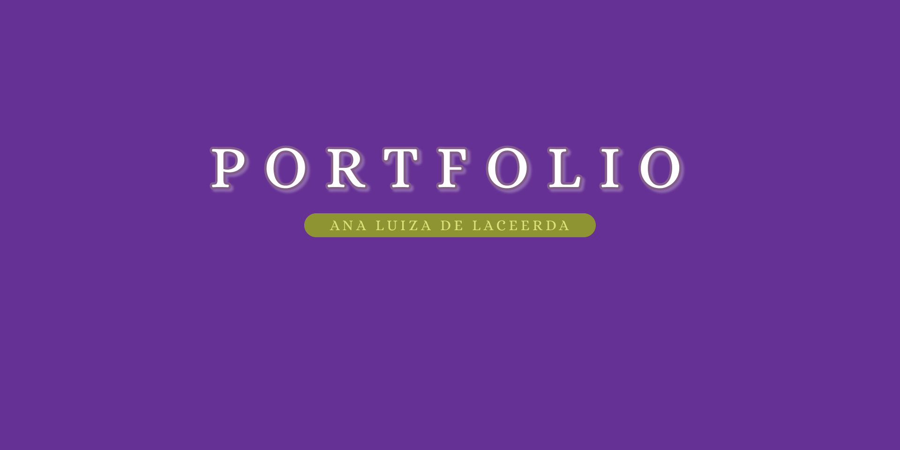

<h1 align="center"> Personal Portfolio </h1>

Projeto exclusivo desenvolvido para exibir minhas qualificações profissionais e projetos desenvolvidos até aqui.

<a href="">Acesse o site finalizado aqui</a>

  

## 🌐 Tecnologias usadas para o desenvolvimento:

 - HTML e CSS

 - JAVASCRIPT

 - GIT e GITHUB

## 🎨 Layout
Você pode visualizar o layout do projeto através <a href="https://delacerdaq.github.io/Portfolio/">desse link</a>  
É necessário ter conta no <a href="figma.com">Figma</a> para acessá-lo.

##

Feito com ♥ by Ana Luiza de Lacerda 

